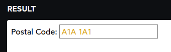
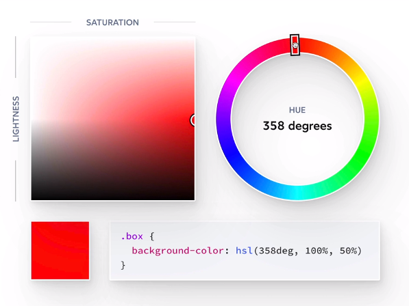
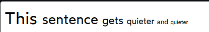
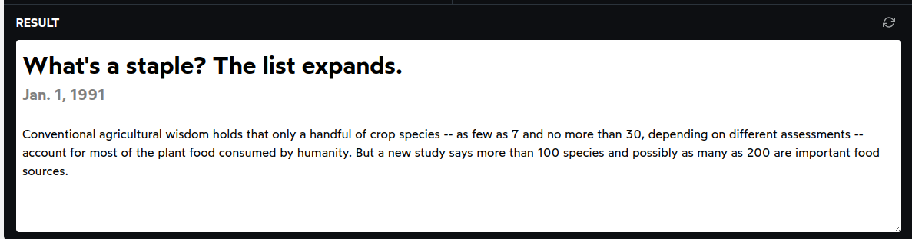

## CSS For JS Developers

Notes from the [CSS For JS dev](https://css-for-js.dev) course

## Terminology

Terminologies are important for building a solid mental mode of CSS.

- [Docs Reference](https://developer.mozilla.org/en-US/docs/Learn/CSS/First_steps/Getting_started)

### Property

Properties in CSS are the attributes you can specify values for, like `color` and `font-size`. In this case is the margin.

```css
p {
  margin: 32px;
}
```

### Selector

A selector is a descriptor that lets you target specific elements on the page. In this case, we're selecting all nodes with the “apple” class.

```css
.apple {
  background-color: red;
  border-radius: 50%;
}
```

### Declaration

A declaration is a combination of a property and a value. In this case, the first declaration has a property of "padding", and a value of "32px".

```css
.code-snippet {
  padding: 32px;
  white-space: pre-wrap;
}
```

### Rule

A rule, also known as a style, is a collection of declarations, targeting one or more selectors. A stylesheet is made up of multiple rules. In this case, all the below code is a rule.

```css
p {
  color: red;
  font-family: sans-serif;
}
```

### Unit

Some values have units, like px, %, or em. In this case, our padding-top has a value of 24px, which is measured in the "px" unit.

```css
p {
  padding-top: 24px;
}
```

## Media Queries

Media queries use the @media syntax. You can kinda think of it as an if statement in JavaScript:

```css
/* CSS */
@media (condition) {
  /* Some CSS that'll run if the condition is met. */
}
```

It's common to use media queries to have alternative interfaces depending on the screen size.

```css
.large-screens {
  display: none;
}

@media (min-width: 300px) {
  .large-screens {
    display: block;
  }
  .small-screens {
    display: none;
  }
}
```

```html
<div class="large-screens">I only show up on large screens.</div>
<div class="small-screens">Meanwhile, you'll only see me on small ones.</div>
```

Inside the parentheses, we typically use either `max-width` to add styles on small screens, or min-width to add styles on larger ones.

The syntax looks quite a lot like the declaration syntax, especially since `max-width`: 1023px is a valid CSS declaration! Unfortunately, this is misleading; In the context of a media query, `max-width` is a “media feature”, not a CSS property. They just happen to share the same name.

### Pseudo-classes

Pseudo-classes let us apply a chunk of CSS based on an element's current state. In this case, we're adding a blue text color when the element is hovered.

- `:hover`

```css
button:hover {
  color: blue;
}
```

- [Docs Reference](https://developer.mozilla.org/en-US/docs/Web/CSS/Pseudo-classes)

- `:focus`

HTML comes with interactive elements like buttons, links, and form inputs. When we interact with one of these elements (either by clicking on it or tabbing to it), it becomes focused. It'll capture keyboard input, so we can type into a form field or press "Enter" to follow a link.

```css
button:focus {
  border: 2px solid royalblue;
  background: royalblue;
  color: white;
}
```

_Why do focus styles matter?_

You may wonder why focus styles are necessary. Why is it helpful to know which element is focused?

Focus styles are primarily useful for folks who don't use a "pointer-style" input device (like a mouse, a trackpad, or a finger on a touchscreen). For example, I built the foundations of this course platform without the use of a keyboard/mouse, due to a repetitive stress injury; initially, I did all of my navigation by voice, speaking "tab" into a microphone to move between focused elements. The focus styles show you where you are on the page, which element is selected.

Fortunately, browsers do come with default focus styles. It varies by browser, but it's typically either a blue or dotted outline. Please don't add outline: none to get rid of the focus outlines (unless you're replacing it with an even-more-prominent set of styles).

- [A11y Reference](https://a11y.coffee/)

- `:checked`

The :checked pseudo-class only applies to checkboxes and radio buttons that are "filled in". You can apply additional styles to indicate that the input is activated:

```css
button:hover {
  color: blue;
}
```

### Pseudo-elements

Pseudo-elements are like pseudo-classes, but they don't target a specific state. Instead, they target "sub-elements" within an element.

For example, we can style the placeholder text in a form input with ::placeholder:

```html
<style>
  input {
    font-size: 1rem;
  }
  input::placeholder {
    color: goldenrod;
  }
</style>

<label>
  Postal Code:
  <input type="text" placeholder="A1A 1A1" />
</label>
```



In terms of syntax, pseudo-elements use two colons instead of one (`::`), though some pseudo-elements also support single-colon syntax.

If we stop and think about it, something pretty interesting is happening here. We haven't explicitly created a <placeholder> element, but by adding the placeholder attribute to the <input> tag, a pseudo-element is created.

This is why they're called pseudo-elements — these selectors target elements in the DOM that we haven't explicitly created with HTML tags.

#### Placeholders and accessibility

Placeholders are criticized because the text is typically very light; if someone has poor vision, they might not be able to read the text at all.

Here's the thing, though: placeholders aren't meant to contain critical information. They're meant to provide an example, to give folks an idea about how to format their data. They should never be used to label an input (use a <label> element instead).

What if the user can't read the placeholder, and enters data in an incorrect format? First, we should build forms that are flexible and support a wide range of user inputs. With the power of JavaScript, we can transform their input into a standardized format!

But, if they really do enter invalid data, a helpful error message should be shown. It should explain what the user did wrong, and how to fix it. And it should be bright and high-contrast.

> Here's a quick test you can use to check if you're using placeholders correctly: if you were to remove all of the placeholders from the form, would it still be usable, and easy to fill out? If the answer is “no”, you have some work to do.

- `before` and `after`

```css
p::before {
  content: "→ ";
  color: deeppink;
}

p::after {
  content: " ←";
  color: deeppink;
}
```

These pseudo-elements are added inside the element, right before and after the element's content. We could rewrite the above example like so:

```html
<style>
  .pseudo-pseudo {
    color: deeppink;
  }
</style>

<p>
  <span class="pseudo-pseudo">→ </span>
  This paragraph has little arrows!
  <span class="pseudo-pseudo"> ←</span>
</p>
```

There is no significant difference in terms of performance between these two examples. ::before and ::after are really just secret spans, nothing more. It's syntactic sugar.

In general, we probably shouldn't use these two pseudo-elements. In a vanilla HTML/CSS world, it can be helpful to "bundle" content in with a CSS selector. In the era of components, however, we have better ways of bundling content.

There are also some accessibility concerns with ::before and ::after. Some screen readers? will try to vocalize the content. Others will ignore them entirely. This inconsistency is problematic.

That said, if the effect is entirely decorative (eg. colorful shapes), I believe it's fine to create them with an empty content string:

```html
<style>
  p::before {
    content: "";
    display: block;
    width: 32px;
    height: 32px;
    border-radius: 50%;
    background-color: peachpuff;
    margin: 8px;
  }
</style>

<p>This paragraph has a decorative circle.</p>
```

## Colors

### Colors formats

#### Keywords

color: red

#### Hex Codes

Hex codes are a way to represent rgb colors

color: #FF0000;

#### RGB Colors

color: rgb(255, 0, 0);

#### HSL Colors

we have 3 values, the first one is represented as degrees, the second one as a percentage, and the third one as a percentage. We use a degree on the first value because it's a circle

- H is the hue, which is the color wheel from 0 to 360 degrees.
- S is the saturation, which is the amount of color in the color wheel.
- L is the lightness, which is the amount of light in the color wheel.

color: hsl(181deg, 64%, 45%);

The nice thing about this way, is that it's intuitive to create variations from the color, since we can adjust saturation or lightness and keep with the same color.

```css
.box {
  color: hsl(181deg, 64%, 45%);
  box-shadow: hsl(181deg, 50%, 30%);
}
```



hue angle color code color name color name (in try colors) luminance
0° #FF0000 red red 30%
15° #FF4000 vermilion orange red 45%
30° #FF8000 orange orange 59%
45° #FFBF00 golden yellow khaki 74%
60° #FFFF00 yellow (web color)=lemon yellow yellow 89%
75° #BFFF00 yellowish green lime 81%
90° #80FF00 yellowish green, chartreuse olive 74%
105° #40FF00 leaf green grass green 66%
120° #00FF00 green green 59%
135° #00FF40 cobalt green bluish green 62%
150° #00FF80 emerald green teal 64%
165° #00FFBF turquoise green, bluish green greenish cyan 67%
180° #00FFFF turquoise blue, cyan (web color) cyan 70%
195° #00BFFF cerulean blue bluish cyan 55%
210° #0080FF azure blue 41%
225° #0040FF blue, cobalt blue blue violet 26%
240° #0000FF blue (web color)=ultramarine violet 11%
255° #4000FF hyacinth purple violet 19%
270° #8000FF violet purple 26%
285° #BF00FF purple purple magenta 34%
300° #FF00FF magenta (web color) magenta 41%
315° #FF00BF reddish purple crimson 38%
330° #FF0080 ruby red, crimson scarlet 36%
345° #FF0040 carmine scarlet red 33%

### Transparency

Certain color formats allow us to supply an additional value for the alpha channel.

This is a measure of opacity. At 1 (default), the color is fully opaque and solid. At 0, the color is invisible. We can specify decimal values to create a semi-transparent color.

Here's how we represent this in HSL:

```css
.first.box {
  background-color: hsl(340deg 100% 50% / 1);
}
.second.box {
  background-color: hsl(340deg 100% 50% / 0.75);
}
```

> What's the deal with the slash?
> The / character is becoming a more common pattern in modern CSS. It isn't about division, it's about separation. The slash allows us to create groups of values. The first group is about the color. The second group is about its opacity.

If your project supports IE, you'll need to use a slightly different syntax:

```css
.colorful-thing {
  color: hsl(200deg, 100%, 50%);
  background-color: hsla(200deg, 100%, 50%, 0.2);
}
```

If you'd like the color to be transparent, you'll need to use the hsla() function instead of the hsl() function.

This is the legacy format, but it's still supported by all browsers. If IE support is important for your project, it's better to stick exclusively with this format.

## Units

### px

Pixels are nice because they correspond more-or-less with what you see on the screen (This is a bit less true now that we have “high-density” displays, like Apple's Retina display, but it's still close enough!
). It's a unit that many developers get comfortable with.

### em

The em unit is an interesting fellow. It's a relative unit, equal to the font size of the current element.

If a heading has a font-size of 24px, and we give it a bottom padding of 2em, we can expect that the element will have 48px of cushion underneath it (2 × 24px).

```html
<style>
  p {
    font-size: 34px;
  }
</style>
<p>
  <span style="font-size: 1em"> This </span>
  <span style="font-size: 0.8em"> sentence </span>
  <span style="font-size: 0.64em"> gets </span>
  <span style="font-size: 0.5em"> quieter </span>
  <span style="font-size: 0.4em"> and </span>
  <span style="font-size: 0.32em"> quieter </span>
</p>
```



How often should you use ems? I don't often reach for them. It can be very surprising when a tweak to font-size affects the spacing of descendant elements.

This is especially true when it comes to modern component architectures. Using em means that a component's UI will change depending on the font size of the container it's placed within. This can be useful, but more often than not, it's a nuisance.

### rem

The rem unit is quite a lot like the em unit, with one crucial difference: it's always relative to the root element, the <html> tag.

All of the rems across your app will be taking their cues from that root HTML tag. By default, the HTML tag has a font size of 16px, so 1rem will be equal to 16px.

```html
<style>
  html {
    font-size: 16px;
  }
  h1 {
    font-size: 2rem;
    margin: 0;
  }
  h2 {
    font-size: 1.25rem;
    margin-bottom: 1.5rem;
    color: gray;
  }
  p {
    font-size: 1rem;
  }
</style>
<h1>What's a staple? The list expands.</h1>
<h2>Jan. 1, 1991</h2>
<p>
  Conventional agricultural wisdom holds that only a handful of crop species --
  as few as 7 and no more than 30, depending on different assessments -- account
  for most of the plant food consumed by humanity. But a new study says more
  than 100 species and possibly as many as 200 are important food sources.
</p>
```



Notice how all the text scales accordingly, when you change the root font size? That's why people like the rem unit. No matter where an element is in the DOM tree, the rem is consistent.

It behaves consistently and predictably, like pixels, but it respects user preferences when it comes to increasing/decreasing default font sizes.

> Please note, you shouldn't actually set a px font size on the html tag. This will override a user's chosen default font size. The only reason we're doing it here is to demonstrate how the rem unit works, and to simulate a user changing their default font size.

If you really want to change the baseline font size for rem units, you can do that using ems or rems:

```css
html {
  /* 20% bigger `rem` values, app-wide! */
  font-size: 1.2em;
}
```

Fun little fact: when selecting the html tag, em and rem units work exactly the same way! Normally, em values can be influenced by their parent elements, but html is the top-level root element on the page. It's also the element rem units are relative to.

_You may have heard that pixels are bad for accessibility because users can't change their size: if a person has poor vision, they may wish to increase the font size, and pixels block that ability._

You may also have heard that this is an urban legend, that it isn't true anymore, and that pixels are fine.

In fact, the true answer sits somewhere between the two.

There are two ways that users can increase the size of text on the page:

They can zoom in, by pressing ⌘ + (or Control +). This scales everything in, and is akin to changing the display resolution

They can set a larger default font size in the browser settings; instead of defaulting to 16px, for example, they may want to default to 20px or 24px

The first option — zooming in and out — will work regardless of which units you use; it scales everything according to a ratio, so if you want the site to be 20% bigger, that will always work.

The second option only works with em or rem units, since it works by changing the default font size of the page.

On the one hand, we can breathe a little easier knowing that users can always increment font size if they wish. But we can't shrug off this concern entirely; zooming in and out is a pain. Every website has a different font size, which means users constantly need to fiddle with the zoom level. If we respected their default font size, they wouldn't have to make tweaks on a per-site basis.

### Percentages

```css
.box {
  width: 250px;
  height: 250px;
  background-color: pink;
}

.child {
  width: 50%;
  height: 75%;
  background-color: black;
}
```

#### The bottom line

A common question I see from developers is "which unit should I use when?". Here's how I think about it:

For typography, I generally use rem, because it has important accessibility benefits.
When it comes to properties that relate to the box model — padding, border, margin — I usually use pixels. It's more intuitive than rem, and there isn't a clear accessibility win.
For width/height, it'll depend on whether I want the element to be a fixed size, or a relative size. I might want one div to always be 250px wide, while another one should be 50% of the available space.
For color, as we saw in the last lesson, I prefer hsl.
I reserve em for the rare cases when I want one property to scale directly with font size.

There are many other units as well. Some of them will be introduced later in the course. Others, like in, are only useful in very specific niche cases (eg. print media), so we won't be covering them.
